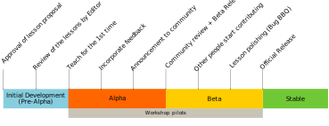

# The lesson life-cycle

* Announcements 
  - letting the community know that the lesson is being prepared for release and what that means
  - Advertising for Bug BBQ
* Bug BBQ
  - How to organize for, how to schedule
  - Communications (when and how to announce)
  - Prep (communicating with maintainers about the process)
  - Facilitating communications during the actual event (real time communications, issue assignments, avoiding duplication of work)
  - Clean-up (maintainers, staff, authors)
    + Lesson release checklist
* Pre-Release Release
* How to communicate about a release
* How to do the release in Zenodo
* Move on website to different category
----

## Scope of this chapter

This chapter focuses on lessons that are being developed
with the intention of becoming officially supported
Carpentries lessons within an existing Lesson Program. 
Lessons being developed for unofficial community use
may go through some or all of the stages discussed here, 
at the discretion of the lesson's authors. Materials 
intended to become part of a **new** Lesson Program
must meet additional requirements as described in 
the [Lesson Programs][lesson-programs] section of
The Carpentries Handbook. 

## Overview and definitions

Before being adopted as an official Carpentries lesson, 
new lessons go through a series of stages designed to
ensure they are sufficiently documented to be teachable
by instructors outside of the initial author group. 

In brief: the **pre-alpha** and **alpha** stages focus on
developing the lesson content, while the **beta** stage
focuses on documenting the lesson, so that it can be
taught by anyone with the appropriate subject knowledge.

Lessons start in the **pre-alpha** stage - this stage
encompasses everything from the initial lesson idea 
through the first time the lesson is taught. This
first draft is usually written by an individual
or a small group of people. From this first draft, the
original authors organize an **alpha pilot** workshop at
their home organisation, and collect and incorporate
feedback from learners and co-instructors. They go
through this iterative process a few times to bring the
lesson to where it is ready to be taught by other
members of The Carpentries community. 

When it is ready for broader teaching and contributions,
the lesson is published for 
the first time on Zenodo and is now in the **beta**
stage. The Carpentries staff will assist the lesson
authors in organising **beta pilots**. 
**Beta pilots**
should be hosted at a different organisation, and 
ideally in a different country than the alpha pilots. 
There are generally two or three beta pilots over a
period of six months.

After beta pilots, the lesson authors and Maintainers
incorporate feedback and produce a polished version of 
the lesson. It is now mature enough and
documented enough so that anyone interested can teach it. The lesson is published on Zenodo and listed on the
Lessons page for the appropriate
Lesson Program. It is added to The Carpentries
workshop request form, and becomes an officially
supported lesson. The lesson is now considered **stable** and will remain in this stage for as long
as it has active support from its Maintainer team.

Lessons with grant support may be eligible for 
support from The Carpentries staff in some or all of
these stages. If you are pursuing grant funding for
lesson development, please get in touch with us at
team@carpentries.org to discuss opportunities for staff
support.

## Where to start

Before you start developing a new lesson, check
to see if there are already people working on creating
a lesson for this topic. The [Carpentries Incubator][incubator] is where our community comes
together to talk about lesson ideas and find 
collaborators. You can check existing [issues][issues] 
or start a new issue if you don't see any discussions
on your topic. The [issue template][issue-template] has
a short set of questions for you to answer. Your answers
to these questions will help us to determine an
appropriate next step for your lesson materials or
idea. It's a good idea to also post to our 
[discussion forum][discuss] and general [Slack channel][slack] to point interested people to your
Incubator issue.

Once you've submitted an issue to The Incubator,
you will be directed towards one of the following
tracks:

1. the Official Track
1. the Community Track
1. the Carpentries Lab Track

### Official Track

If The Carpentries have committed to develop a lesson
on this topic (usually through grant funding), our
Curriculum Team will work closely with you from
pre-alpha through stable release, providing support on
each step of the process. Your lesson will be 
developed in one of the official Lesson Program GitHub 
organisations. 

### Community Track

If The Carpentries has not committed to develop a 
lesson on this topic, but the lesson is potentially of
general interest to our community, the lesson authors
will complete the development process independently. 
You will develop
your lesson in the Carpentries Incubator and it will be
made available through the Incubator
website. If the lesson attracts a strong community
of contributors, it will be considered for adoption
as an official Carpentries lesson. 

### Carpentries Lab Track

This track is available for lessons on the Community
Track that do not attract a strong contributor
community. Lesson authors will be able to submit their
materials for peer-review. After the peer-review
process, the lessons will be hosted in The Carpentries
Lab and will be officially endorsed by The Carpentries
as high-quality resources.

## Early development: pre-alpha through alpha

We will create a repository for you in the appropriate
GitHub organization, using our 
[lesson template][lesson-template]. You will use the
guidelines in the first four chapters of this handbook
to develop your content. The Curriculum Team will 
be available to answer questions about the template
and provide pedagogical guidance. For lessons on the 
Official Track, authors will meet regularly with 
a member of the Curriculum Team to work through the
lesson drafting process.

## Field test: alpha stage

Once your lesson is ready to be taught for the first
time, it will enter the **alpha stage**. Field-testing a
lesson is a good opportunity to receive and incorporate
feedback from learners, instructors, and workshop
helpers who can compare their expectations to
reality. The initial feedback gathered during this first
workshop is really important. 

During the workshop, pilot instructors and helpers should take detailed notes, including:  
- time lengths used to teach each section  
- time lengths used for each exercise  
- technical issues that arose during installation  
- bugs or parts of the lesson code that didn't work as expected  
- incorrect exercise solutions  
- questions learners asked (and their answers)   
- parts of the lesson that were confusing for learners  

These notes can be collected in an Etherpad, Google Doc, or other collaborative document that is shared
with co-instructors and workshop helpers. This document should not be shared with workshop learners, 
as it would add significantly to their cognitive load. 

After the workshop, instructors should share the notes document with the lesson authors - who 
will convert the notes into individual issues in the lesson repo. For two-day workshops, lesson authors should expect
to spend at least four hours to create follow-up issues, and at least
eight hours to putting in PRs to fix these issues. For two pilot workshops, this translates
to ~24 hours of work, which can be distributed across the lesson authors. 

## The polishing ("Beta")

The "Beta" stage lasts approximately 6 months. During this time, members of The Carpentries community can teach it and contribute to the content of the lesson. Around the 4th month in this stage, you will organize a "Lesson Polishing" event (aka Bug BBQ). The main goal of this phase of the lesson development is to develop the documentation needed to ensure that people who have not contributed to the initial development efforts of the lesson have enough information to teach it effectively.

After a final check from one of The Carpentries' Editors, we will create a stable release for the lesson that will be listed on our website. Anyone in our community, including local Carpentries communities, will be able to use the lesson in their workshops or meetups.

The Carpentries Community Manager will make an announcement that a new "Alpha" lesson is available to contribute to and can be taught by instructors interested in early-adoption of the lesson.

After a few iterations of teaching and integrating feedback (and at least 2 early workshop pilots), you will let the Carpentries Editor know that your lesson is ready to be reviewed. The Editor will select 2-3 reviewers within The Carpentries community with teaching experience and/or appropriate domain expertise, who will provide an open and friendly review of the lesson. After incorporating feedback and comments from the reviewers, your lesson will be badged "Reviewed by the Carpentries Community" and will be listed on our websites as such.

During this process, you will have the possibility to include a short paper describing your lesson in the GitHub repository and have your lesson considered for publication in [JOSE](http://jose.theoj.org/), the Journal of Open Science Education. Once your lesson has gone through the peer-review process and has been approved by the Editor, we will create an official Zenodo release for it, and the lesson will enter the "Beta" stage.

## The stable lesson

[discuss]: https://carpentries.topicbox.com/groups/discuss
[incubator]: https://github.com/carpentries-incubator/proposals/blob/master/README.md
[issues]: https://github.com/carpentries-incubator/proposals/issues
[issue-template]: https://github.com/carpentries-incubator/proposals/blob/master/ISSUE_TEMPLATE.md
[lesson-programs]: https://docs.carpentries.org/topic_folders/governance/lesson-program-policy.html
[lesson-template]: https://github.com/carpentries/styles
[slack]: https://swc-slack-invite.herokuapp.com/

